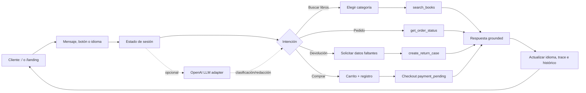

# Bookly — flujo del agente

El flujo cubre las dos superficies del producto: la aplicación de soporte en `/` y el widget conversacional de la landing en `/landing`.

## Lectura rápida

1. La interfaz recibe texto, una acción rápida o una selección de idioma.
2. El estado de sesión conserva idioma, carrito, pedido y contexto conversacional.
3. El orquestador decide si necesita aclarar datos o ejecutar una herramienta.
4. Las herramientas consultan datos de libros, pedidos, devoluciones o checkout.
5. La respuesta se presenta en el idioma vigente y actualiza histórico y trace.
6. OpenAI puede apoyar clasificación y redacción, pero las respuestas operativas siguen ancladas a herramientas y datos disponibles.
